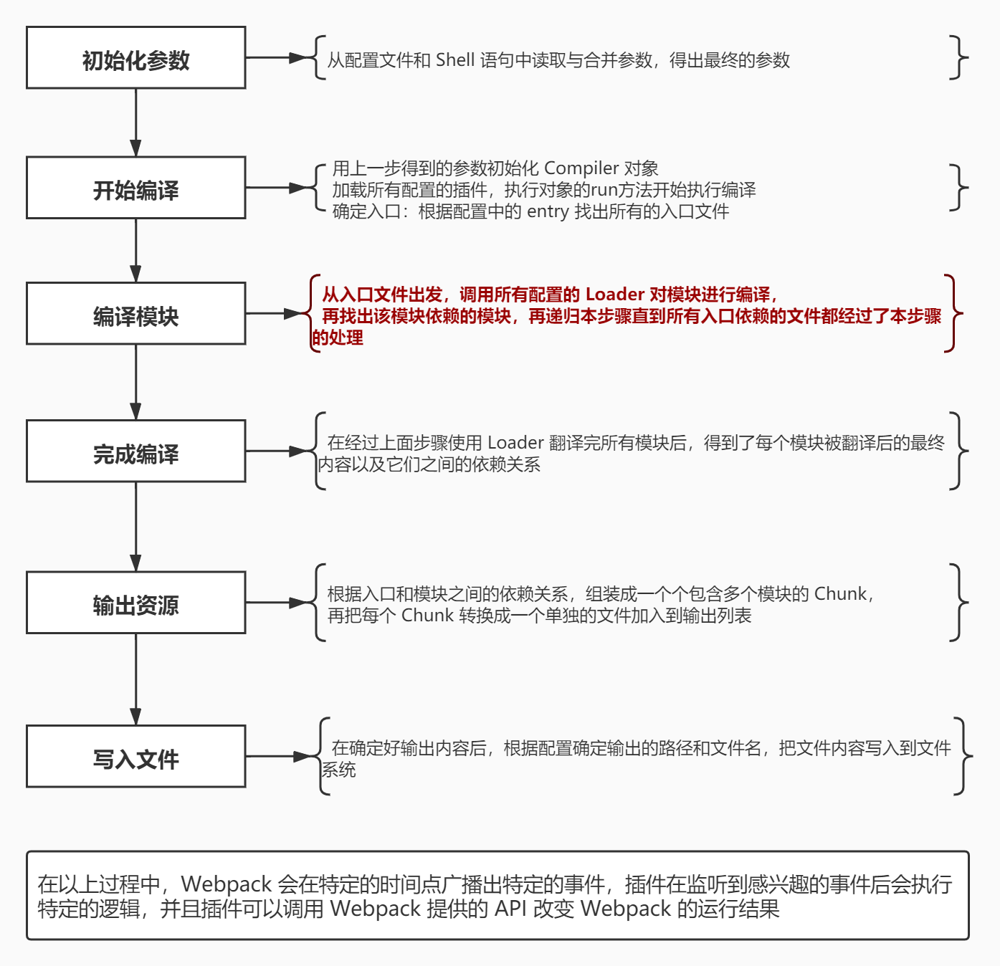

什么是loader？loader其实是一个函数，它接受一个参数source，source是源代码，返回处理后的内容。例如下面：

inline-loader.js
```js
function loader(source) {
  console.log("inline1");
  return source + "//inline1";
}

module.exports = loader;
```

## 一. loader 运行的总体流程


## 二、loader-runner
