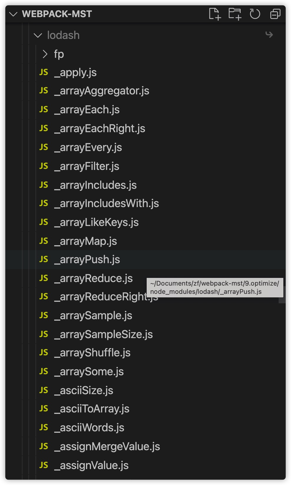

扫盲：tree shaking需要对应的包也要做响应的支持，并不是所有的库都可以做tree shaking。比如lodash包可以做tree shaking，react库无法支持tree shaking。因为可以做tree shaking的库，必须要符合下面的样子：

这种库，是可以做tree shaking的。

如下的代码方式：
```js
import {sort, has} from 'lodash';
```
经过tree shaking后，会变成如下的形式：
```js
import sort from 'lodash/sort';
import has from 'lodash/has';
```
经过tree shaking的代码，打包的时候，只会打包sort和has方法，不会打包lodash里未用到的方法。