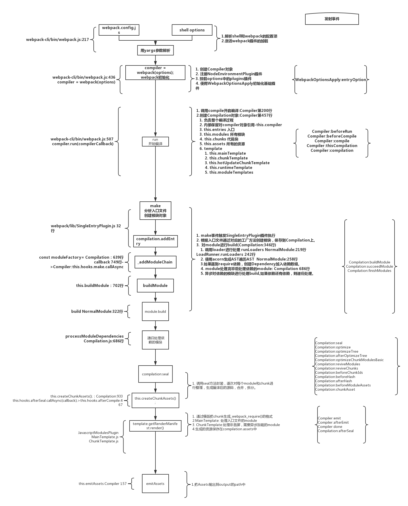

# 一、webpack流程介绍
webpack通过plugins实现各种功能。开发者可以通过插件引入他们自己的行为到webpack构建流程中。但是需要理解一些webpack底层的内部特性来做相应的钩子。

## webpack流程：

加载插件的对象
| 对象 | 钩子 |
| :-  | :- |
| Compiler 编译对象 | `run` 开始运行 |
|  | `compile` 开始编译 |
|  | `compilation` 创建编译对象 |
|  | `make` 创建模块对象 |
|  | `emit` 发射文件 |
|  | `done` 完成 |
| Compilation 资源构建 | `buildModule` 创建模块 |
|  | `normalModuleLoader` 普通模块加载 |
|  | `succeedModule` 模块加载完成 |
|  | `finishModules` 所以来的模块完成 |
|  | `seal 封装 整理代码 |
|  | `optimize` 优化 |
|  | `after-seal` 封装后 |
| Module Factory 模块处理 | `beforeResolver` 解析前 |
|  | `afterResolver` 解析后 |
|  | `parser` 解析 |
| Module 模块 | - |
| Parser 解析 | `program` 开始遍历 |
|  | `statement` 语句 |
|  | `call` 调用 |
|  | `expression` 处理表达式 |
| Template 模板 | `hash` 处理hash |
|  | `bootstrap` 启动 |
|  | `localVars` 变量 |
|  | `render` 渲染 |

> Compiler是编译对象，代表了完整的webpack环境配置，全局下只有一份。Compilation是资源构建，代表了一次资源版本构建，每次构建的时候都会产生一个Compilation对象。在插件开发中，它俩是我们需要掌握的两个最重要的的对象。

Module Factory是解析模块的，解析模块的时候，需要用到AST语法树，就是Parser解析对象。Parser解析的时候，要递归每一行语法。

